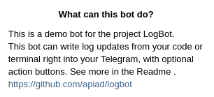

# LogBot [](https://pypi.org/project/logbot-telegram/) [](https://pypi.org/project/logbot-telegram/) [](https://t.me/apiad_demo_logbot)

> A Telegram bot that you can log to from bash or Python and manage long running processes.

```
pip install logbot-telegram
```

## Quickstart

> **NOTE:** The following example is using a _demo_ bot that I personally host at [apiad.net:6778](http://apiad.net:6778). This bot can and will be stopped, restarted or even destroyed without notice. Refer to the section on **Setting your own** for more details.

First, go to Telegram and open a chat with [LogBot (Demo)](http://t.me/apiad_demo_logbot). You'll see this initial message.



Hit the **Start** button, and the bot will send you a *secret token*:


Now with this secret token you can communicate to the bot through HTTP. The protocol is very simple. Just a send a `POST` request to the bot's API with an encoded `json` data:

```bash
curl -XPOST http://apiad.net:6778 -d \
"{                                   \
    \"token\": \"ytp96gWZ8uHE\",     \
    \"msg\": \"Hello World\"         \
}"
{"msg":"Hello World", "id":121}
```

Voilá, your message will be forwared to Telegram:


You can send messages with Markdown formatting:

```bash
curl -XPOST http://apiad.net:6778 -d \
"{                                   \
    \"token\": \"ytp96gWZ8uHE\",     \
    \"msg\": \"*Hello* _World_\"     \
}"
{"msg":"*Hello* _World_", "id":122}
```


Finally, you can send **actions**, that will be rendered as buttons in Telegram.
When you click the button, and **only when you click it**, you will get a response back with the clicked option:

```bash
curl -XPOST http://apiad.net:6778 -d    \
"{                                      \
    \"token\": \"ytp96gWZ8uHE\",        \
    \"msg\": \"Wanna try?\",            \
    \"actions\": [\"Yes\", \"No way\"]  \
}"
{"msg":"Wanna try?","response":"Yes", "id":123}
```


> **NOTE:** By default you have 60 seconds to answer before a response timeout is raised. This hard limit might be changed in future versions.

If you send a `progress` key with a value between `0` and `1` (`float`), the message will also render a progress bar.
If you send an `edit` key with the value (`int`) of the `id` of a previous response, you will edit that message instead of sending a new one.
You can use these two features together to create animated progress bars.

## Python API

If you talk Python, you can clone this project and use a set of simple tools to skip all that `curl`.

```
pip install logbot-telegram
```

* `send` simply sends the message.

```python
>>> from logbot import Client
>>> c = Client(token="<token>", host="http://apiad.net", port=6778)
>>> c.send("Hello World")
```

* `ask` will send the corresponding questions as buttons and return the reply:

```python
>>> c.ask("Do you?", "A", "B", "C")
'C' # Supposedly you hit C in Telegram
```

* `yes` will simply send `Yes` and `No` and return `True` or `False`:

```python
>>> if c.yes("Do you?"):
>>>     print("It does!")
'It does!' # Supposedly you hit Yes in Telegram
```

The `send` method also receives an optional `progress` value to render a progress bar.
Also, a parameter `edit=True` will make it edit the last send message, instead of a new one.
With these options you can make an animated progress bar like:

```python
>>> for i in range(0, 11):
...     c.send("Progress", progress=i/10, edit=True)
...     time.sleep(1)
```

These are also available as simple functions, which receive `token`, `host` and `port` on every call. The `Client` class just simplifies passing those values all the time.

## What can I do with this?

Some simple ideas:

* **Log directly into Telegram from your code**. For example, using Python `request` you can easily make any long-running script to periodically send updates.
* **Monitor a server**. Using `bash`, `curl` and `cron` you can send yourself periodically info about your CPU, memory and I/O ussage.
* **Quick responses on Telegram**. By using the response actions, you can interact with running code, either to take decisions, kill long running processes, retry things that broke, etc. Your imagination is the limit.

## Setting up your own

For testing, and while my server handles it, you can use the bot I have set up. It's free and for that reason I might decide to turn it off at any given time without any advice. So, if you want a long time working solution, you will have to set up your own.

1. Create your Telegram bot with [BotFather](t.me/botfather). If you don't know what I mean, read the Telegram documentation on bots. It's all over the Internet.
2. BotFather will give you a `TOKEN`. Make sure to write it down.
3. Run `pip install logbot-telegram`.
4. Run `export TOKEN=<your-token>`.
5. You can run `python -m logbot` now. It will listen by default at `localhost:6778`.
6. You can change the `HOST` and `PORT` with environment variables.

## Collaboration

It's MIT, so you know the drill. Fork, edit, pull request, repeat.

## License

> MIT License
>
> Copyright (c) 2019 Alejandro Piad
>
> Permission is hereby granted, free of charge, to any person obtaining a copy
> of this software and associated documentation files (the "Software"), to deal
> in the Software without restriction, including without limitation the rights
> to use, copy, modify, merge, publish, distribute, sublicense, and/or sell
> copies of the Software, and to permit persons to whom the Software is
> furnished to do so, subject to the following conditions:
>
> The above copyright notice and this permission notice shall be included in all
> copies or substantial portions of the Software.
>
> THE SOFTWARE IS PROVIDED "AS IS", WITHOUT WARRANTY OF ANY KIND, EXPRESS OR
> IMPLIED, INCLUDING BUT NOT LIMITED TO THE WARRANTIES OF MERCHANTABILITY,
> FITNESS FOR A PARTICULAR PURPOSE AND NONINFRINGEMENT. IN NO EVENT SHALL THE
> AUTHORS OR COPYRIGHT HOLDERS BE LIABLE FOR ANY CLAIM, DAMAGES OR OTHER
> LIABILITY, WHETHER IN AN ACTION OF CONTRACT, TORT OR OTHERWISE, ARISING FROM,
> OUT OF OR IN CONNECTION WITH THE SOFTWARE OR THE USE OR OTHER DEALINGS IN THE
> SOFTWARE.
